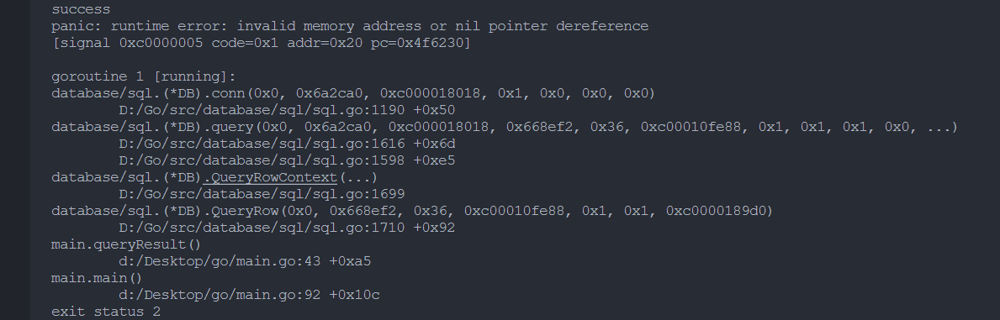
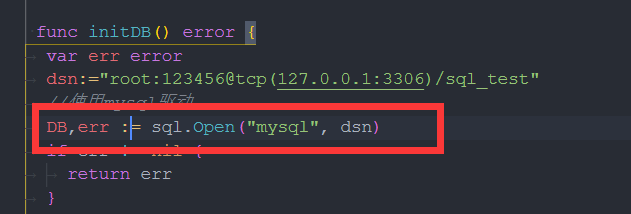
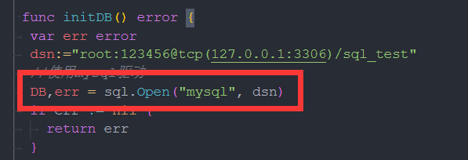
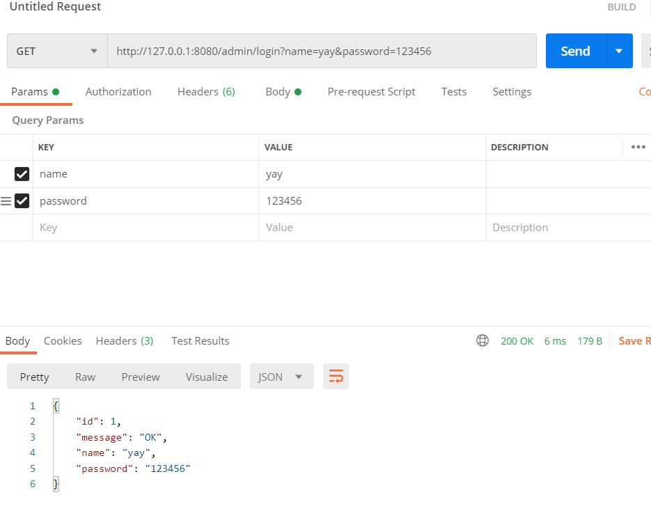
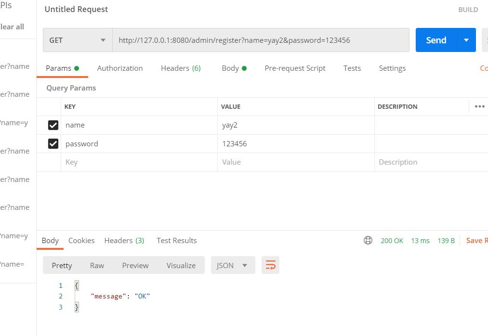

# 坑点

## 操作数据库

### 错误点



他总是报这样的错误.我一直没有懂这个错误.翻译是:==无效的内存地址或无指针取消引用== 然后百度发现

> 典型的Go 指针声明后没有对指针先初始化而直接赋值导致的错误。

我以为是我单行查询时候出现出现的错误,我看源码,以为是sql.Row导致,但是还是报错.

而且当你不运行你写的查询函数时候,他却不提示错误,导致我的目光都在查询函数上

### 解决点

[解决](https://studygolang.com/articles/19672?fr=sidebar)

其实他提示的错误的行数也是错的.

真正出错的是这一段代码(后面一个是正确的)



正确的代码:



发现仅仅是`=`和`:=`的一个小小区别

>原因就是
>当我们在使用 := 时 会创建一个新的db变量,新的db会把全局变量db覆盖掉

其实很好理解.后续的代码我们都将使用db变量里面的函数,但是当你运行上面一段代码(有`:=`),就把全局的db变量覆盖,导致后续用的是覆盖之后的db变量


# 登录与注册

## 第一版

### 文件结构

> |-- go
>     |-- go.mod
>     |-- go.sum
>     |-- main.go
>     |-- README.md
>     |-- api
>     |   |-- api.go
>     |-- img
>     |-- mysql
>     |   |-- mysql.go
>     |-- router
>     |   |-- router.go
>     |-- templates
>         |-- index.tmpl

### 简单解释一下

现在的第一版,就是一个很简单的==客户端发送请求,服务端来回应==的demo





### 后续优化的地方

- 权限管理：基于`jwt`和`casbin`实现的权限管理                  (未完成)

* 文件上传下载：实现基于七牛云的文件上传操作（为了方便大家测试，我公开了自己的七牛测试号的各种重要token，恳请大家不要乱传东西）                 (未完成)
* 分页封装：前端使用mixins封装分页，分页方法调用mixins即可                 (未完成)
* 用户管理：系统管理员分配用户角色和角色权限。                 (未完成)
* 角色管理：创建权限控制的主要对象，可以给角色分配不同api权限和菜单权限。                 (未完成)
* 菜单管理：实现用户动态菜单配置，实现不同角色不同菜单。                 (未完成)
* api管理：不同用户可调用的api接口的权限不同。                 (未完成)
* 配置管理：配置文件可前台修改（测试环境不开放此功能）。                 (未完成)
* 富文本编辑器：MarkDown编辑器功能嵌入。                 (未完成)
* 条件搜索：增加条件搜索示例。                 (未完成)
* restful示例：可以参考用户管理模块中的示例API。                 (未完成)

```
前端文件参考: src\view\superAdmin\api\api.vue 
后台文件参考: model\dnModel\api.go 
```

- 多点登录限制：需要在`config.yaml`中把`system`中的`useMultipoint`修改为true(需要自行配置Redis和Config中的Redis参数，测试阶段，有bug请及时反馈)。                 (未完成)
- 分片长传：提供文件分片上传和大文件分片上传功能示例。                 (未完成)
- 表单生成器：表单生成器借助 [@form-generator](https://github.com/JakHuang/form-generator)。                 (未完成)
- 代码生成器：后台基础逻辑以及简单curd的代码生成器。                 (未完成)

## 优化

### JWT认证

思维上其实了解JWT后其实不是很难.

步骤:

* 生成JWT
* 解析JWT
* 路由套上中间件

[JWT参考](https://www.cnblogs.com/jianga/p/12487267.html)

[JWT认识](https://www.cnblogs.com/cjsblog/p/9277677.html)

[阮一峰JWT](https://www.ruanyifeng.com/blog/2018/07/json_web_token-tutorial.html)

#### 为什么需要JWT

> 在之前的一些web项目中，我们通常使用的是`Cookie-Session`模式实现用户认证。相关流程大致如下：
>
> 1. 用户在浏览器端填写用户名和密码，并发送给服务端
> 2. 服务端对用户名和密码校验通过后会生成一份保存当前用户相关信息的session数据和一个与之对应的标识（通常称为session_id）
> 3. 服务端返回响应时将上一步的session_id写入用户浏览器的Cookie
> 4. 后续用户来自该浏览器的每次请求都会自动携带包含session_id的Cookie
> 5. 服务端通过请求中的session_id就能找到之前保存的该用户那份session数据，从而获取该用户的相关信息。
>
> 这种方案依赖于客户端（浏览器）保存Cookie，并且需要在服务端存储用户的session数据。
>
> 在移动互联网时代，我们的用户可能使用浏览器也可能使用APP来访问我们的服务，我们的web应用可能是前后端分开部署在不同的端口，有时候我们还需要支持第三方登录，这下`Cookie-Session`的模式就有些力不从心了。
>
> JWT就是一种基于Token的轻量级认证模式，服务端认证通过后，会生成一个JSON对象，经过签名后得到一个Token（令牌）再发回给用户，用户后续请求只需要带上这个Token，服务端解密之后就能获取该用户的相关信息了。

